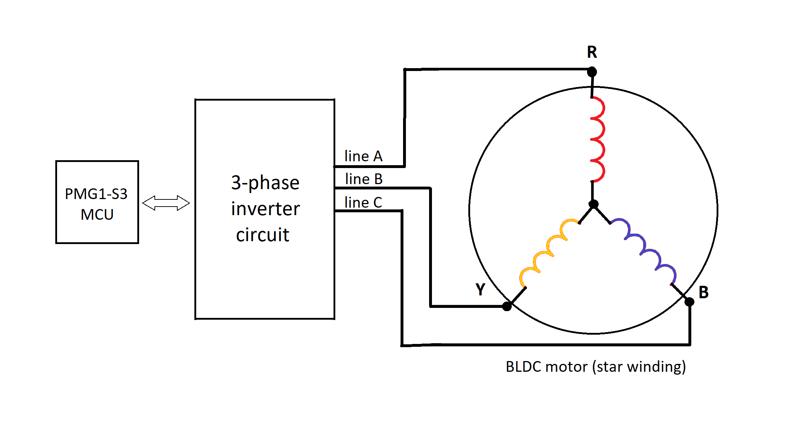
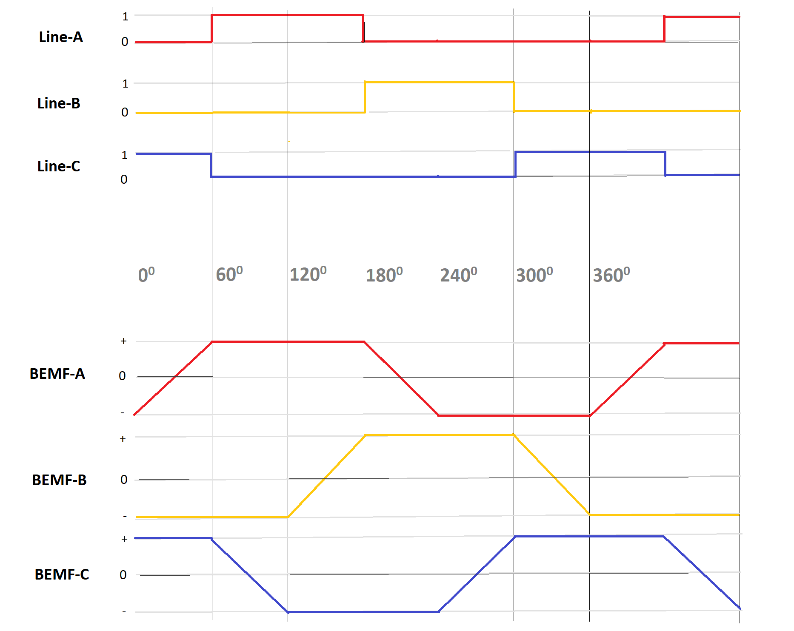
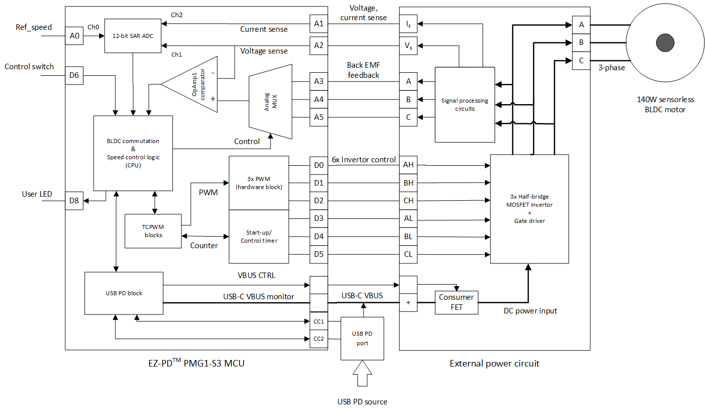
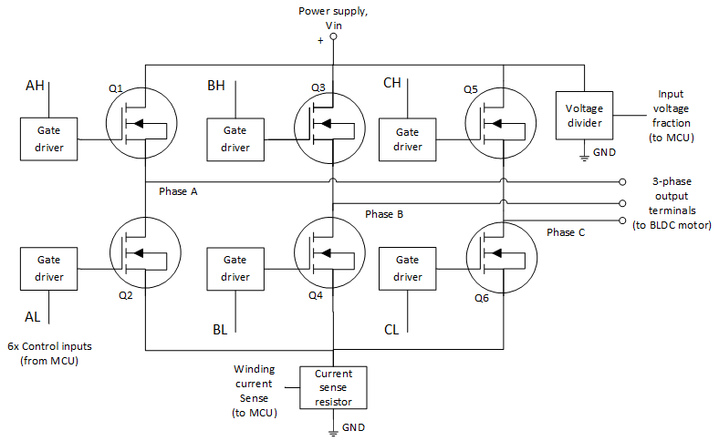
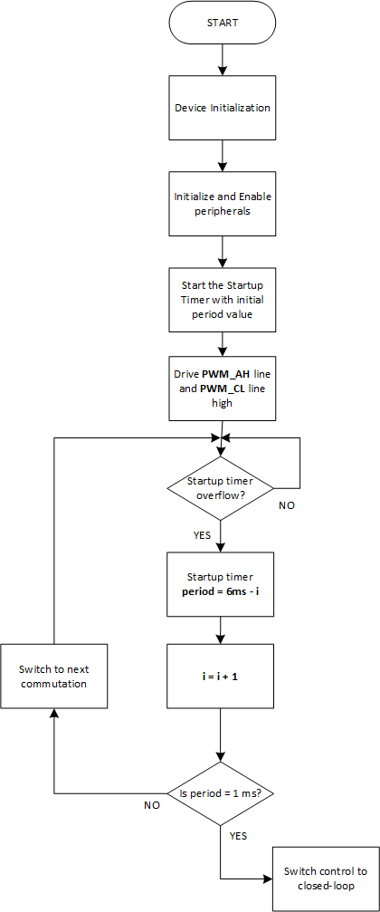
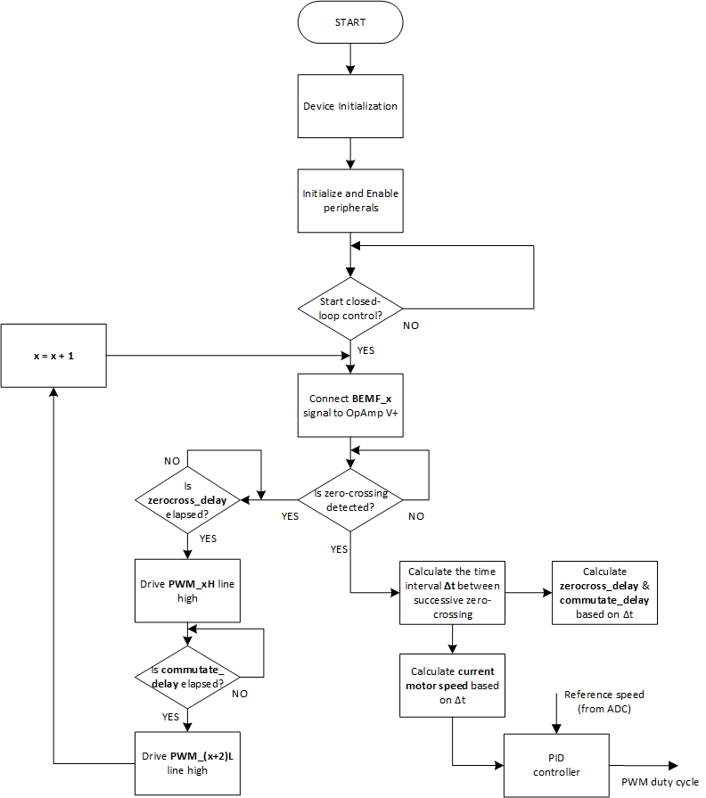
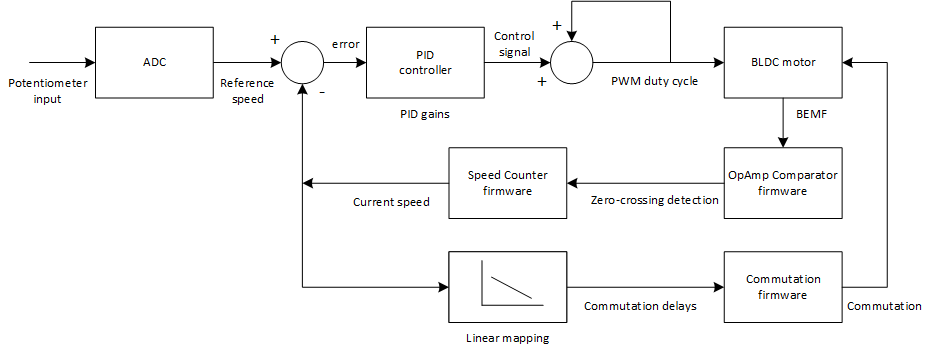
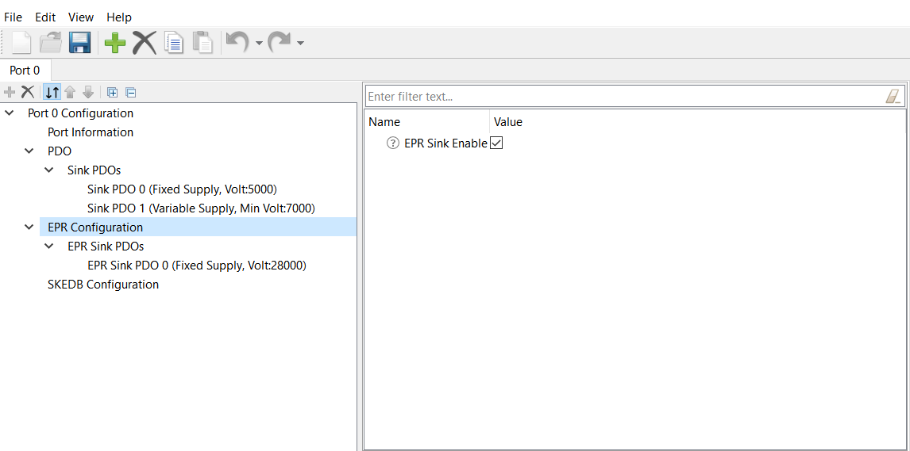
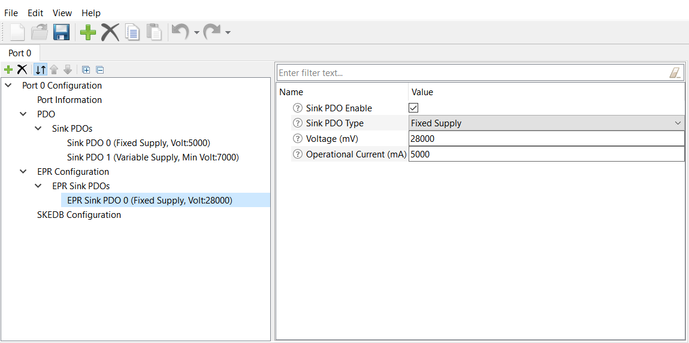

# EZ-PD&trade; PMG1 MCU: USB PD sensorless BLDC motor

This code example demonstrates EZ-PD&trade; PMG1-S3 device-based solution for controlling sensorless Brushless DC (BLDC) motor of up to 140 watts, directly through USB PD power derived from a Type-C cable in 28-V Extended Power Range (EPR) mode.

[View this README on GitHub.](https://github.com/Infineon/mtb-example-pmg1-usbpd-sensorless-bldc-motor)

[Provide feedback on this code example.](https://cypress.co1.qualtrics.com/jfe/form/SV_1NTns53sK2yiljn?Q_EED=eyJVbmlxdWUgRG9jIElkIjoiQ0UyMzY3MjYiLCJTcGVjIE51bWJlciI6IjAwMi0zNjcyNiIsIkRvYyBUaXRsZSI6IkVaLVBEJnRyYWRlOyBQTUcxIE1DVTogVVNCIFBEIHNlbnNvcmxlc3MgQkxEQyBtb3RvciIsInJpZCI6ImVhc292YXJnaGVzZSIsIkRvYyB2ZXJzaW9uIjoiMS4wLjAiLCJEb2MgTGFuZ3VhZ2UiOiJFbmdsaXNoIiwiRG9jIERpdmlzaW9uIjoiTUNEIiwiRG9jIEJVIjoiV0lSRUQiLCJEb2MgRmFtaWx5IjoiVFlQRS1DIn0=)

## Requirements

- [ModusToolbox&trade; software](https://www.infineon.com/cms/en/design-support/tools/sdk/modustoolbox-software) v3.0 or later (tested with v3.0)
- Board support package (BSP) minimum required version: 3.0.0
- Programming language: C
- Associated parts: [EZ-PD&trade; PMG1-S3 MCU](https://www.infineon.com/cms/en/product/universal-serial-bus/usb-c-high-voltage-microcontrollers/ez-pd-pmg1-s3-high-voltage-mcu-with-usb-c-pd/)

## Supported toolchains (make variable 'TOOLCHAIN')

- GNU Arm® embedded compiler v10.3.1 (`GCC_ARM`) - Default value of `TOOLCHAIN`
- Arm&reg; compiler v6.13 (`ARM`)
- IAR C/C++ compiler v8.42.2 (`IAR`)

## Supported hardware

- [EZ-PD&trade; PMG1-S3 prototyping kit](https://www.infineon.com/CY7113) (`PMG1-CY7113`) - Default value of `TARGET`

- EZ-PD&trade; PMG1-S3 sensorless BLDC control reference schematic for BLDC motor driver

**Note:** See the application note - [AN237305](https://www.infineon.com/an237305)

- BLY172S-24-4000 BLDC motor

## Hardware setup

1. See the application note - [AN237305](https://www.infineon.com/an237305) to make all the required connections from CY7113 (PMG1-S3 prototyping kit) to the motor driver board.(PMG1-S3 prototyping kit CY7113 need to remove **LED5** and **LED6** to fit application note-[AN237305].)
2. Verify the following GPIO connections mentioned in table 1.

**Table 1. GPIO connections required between PMG1-S3 device and external circuit**

 PMG1-S3 48-QFN GPIO | Motor driver  | I/O | Description |
 ------------------- | ------------------ |------------------| ------------------
 P2.2 | BEMF-A | Input | Back EMF signal feedback from line A
 P2.3 | BEMF-B | Input | Back EMF signal feedback from line B
 P2.4 | BEMF-C | Input | Back EMF signal feedback from line C
 P2.1 | SPEED_POT | Input | Speed control potentiometer to provide analog input voltage
 P1.5 | CTRL_SW | Input | User switch for turning on/off the motor, control reset and direction reversal
 P3.0 | CURRENT_SENSE | Input | To measure the phase current of motor
 P3.3 | VIN_SENSE | Input | To measure the DC bus voltage supplied to the motor
 P5.5 | USER_LED | Output | To indicate various error conditions
 P1.3 | PWM-AH | Output | Control signal to the high-side MOSFET Q1
 P1.4 | PWM-BH | Output | Control signal to the high-side MOSFET Q3
 P6.2 | PWM-CH | Output | Control signal to the high-side MOSFET Q5
 P6.1 | PWM-AL | Output | Control signal to the low-side MOSFET Q2 
 P6.3 | PWM-BL | Output | Control signal to the low-side MOSFET Q4 
 P6.0 | PWM-CL | Output | Control signal to the low-side MOSFET Q6 
 P3.6 | UART-TX | Output | To print the run-time data of motor on a serial monitor

3. A 28-V EPR supported USB PD adapter is recommended as the power source to be connected to the PMG1-S3 kit. However, a USB PD adapter with 20 V, 5 A PDO also will support the motor operation. 

4. A standard EPR mode supported USB Type-C cable is used to establish connection between the Power Delivery (PD) source and sink devices.

5. Wire the three-phase terminals (A, B, and C) of the BLDC motor to the corresponding three output lines A, B, and C of the half-bridge MOSFET inverter circuit as shown in figure 1.

**Figure 1. Wiring diagram for BLDC motor**



**Note:** The firmware requires the centre terminal B of the BLDC motor to be compulsorily connected to the output line B of the inverter circuit. However, the other two terminals, A and B can be interchangeably connected to the outputs lines A or C of the inverter, which will decide the direction of rotation of the motor.

## Software setup

[EZ-PD&trade; Protocol Analyzer Utility](https://www.infineon.com/cms/en/product/evaluation-boards/cy4500) may be used to analyze and debug the USB PD communication on the Configuration Channel (CC).


## Using the code example

Create the project and open it using one of the following:

<details><summary><b>In Eclipse IDE for ModusToolbox&trade; software</b></summary>

1. Click the **New Application** link in the **Quick Panel** (or, use **File** > **New** > **ModusToolbox&trade; Application**). This launches the [Project Creator](https://www.infineon.com/ModusToolboxProjectCreator) tool.

2. Pick a kit supported by the code example from the list shown in the **Project Creator - Choose Board Support Package (BSP)** dialog.

   When you select a supported kit, the example is reconfigured automatically to work with the kit. To work with a different supported kit later, use the [Library Manager](https://www.infineon.com/ModusToolboxLibraryManager) to choose the BSP for the supported kit. You can use the Library Manager to select or update the BSP and firmware libraries used in this application. To access the Library Manager, click the link from the **Quick Panel**.

   You can also just start the application creation process again and select a different kit.

   If you want to use the application for a kit not listed here, you may need to update the source files. If the kit does not have the required resources, the application may not work.

3. In the **Project Creator - Select Application** dialog, choose the example by enabling the checkbox.

4. (Optional) Change the suggested **New Application Name**.

5. The **Application(s) Root Path** defaults to the Eclipse workspace which is usually the desired location for the application. If you want to store the application in a different location, you can change the *Application(s) Root Path* value. Applications that share libraries should be in the same root path.

6. Click **Create** to complete the application creation process.

For more details, see the [Eclipse IDE for ModusToolbox&trade; software user guide](https://www.infineon.com/MTBEclipseIDEUserGuide) (locally available at *{ModusToolbox&trade; software install directory}/ide_{version}/docs/mt_ide_user_guide.pdf*).

</details>

<details><summary><b>In command-line interface (CLI)</b></summary>

ModusToolbox&trade; software provides the Project Creator as both a GUI tool and the command line tool, "project-creator-cli". The CLI tool can be used to create applications from a CLI terminal or from within batch files or shell scripts. This tool is available in the *{ModusToolbox&trade; software install directory}/tools_{version}/project-creator/* directory.

Use a CLI terminal to invoke the "project-creator-cli" tool. On Windows, use the command line "modus-shell" program provided in the ModusToolbox&trade; software installation instead of a standard Windows command-line application. This shell provides access to all ModusToolbox&trade; software tools. You can access it by typing `modus-shell` in the search box in the Windows menu. In Linux and macOS, you can use any terminal application.

The "project-creator-cli" tool has the following arguments:

Argument | Description | Required/optional
---------|-------------|-----------
`--board-id` | Defined in the `<id>` field of the [BSP](https://github.com/Infineon?q=bsp-manifest&type=&language=&sort=) manifest | Required
`--app-id`   | Defined in the `<id>` field of the [CE](https://github.com/Infineon?q=ce-manifest&type=&language=&sort=) manifest | Required
`--target-dir`| Specify the directory in which the application is to be created if you prefer not to use the default current working directory | Optional
`--user-app-name`| Specify the name of the application if you prefer to have a name other than the example's default name | Optional


The following example clones the "[USB PD sensorless BLDC motor](https://github.com/Infineon/mtb-example-pmg1-usbpd-sensorless-bldc-motor)" application with the desired name "USBPDSensorlessBLDCMotor" configured for the *PMG1-CY7113* BSP into the specified working directory, *C:/mtb_projects*:

   ```
   project-creator-cli --board-id PMG1-CY7113 --app-id mtb-example-pmg1-usbpd-sensorless-bldc-motor --user-app-name USBPDSensorlessBLDCMotor --target-dir "C:/mtb_projects"
   ```

**Note:** The project-creator-cli tool uses the `git clone` and `make getlibs` commands to fetch the repository and import the required libraries. For details, see the "Project creator tools" section of the [ModusToolbox&trade; software user guide](https://www.infineon.com/ModusToolboxUserGuide) (locally available at *{ModusToolbox&trade; software install directory}/docs_{version}/mtb_user_guide.pdf*).

To work with a different supported kit later, use the [Library Manager](https://www.infineon.com/ModusToolboxLibraryManager) to choose the BSP for the supported kit. You can invoke the Library Manager GUI tool from the terminal using `make library-manager` command or use the Library Manager CLI tool "library-manager-cli" to change the BSP.

The "library-manager-cli" tool has the following arguments:

Argument | Description | Required/optional
---------|-------------|-----------
`--add-bsp-name` | Name of the BSP that should be added to the application | Required
`--set-active-bsp` | Name of the BSP that should be as active BSP for the application | Required
`--add-bsp-version`| Specify the version of the BSP that should be added to the application if you do not wish to use the latest from manifest | Optional
`--add-bsp-location`| Specify the location of the BSP (local/shared) if you prefer to add the BSP in a shared path | Optional

<br>

The following example adds the PMG1-CY7113 BSP to the already created application and makes it the active BSP for the app:

   ```
   ~/ModusToolbox/tools_3.0/library-manager/library-manager-cli --project "C:/mtb_projects/USBPDSensorlessBLDCMotor" --add-bsp-name PMG1-CY7113--add-bsp-version "latest-v3.X" --add-bsp-location "local"

   ~/ModusToolbox/tools_3.0/library-manager/library-manager-cli --project "C:/mtb_projects/USBPDSensorlessBLDCMotor" --set-active-bsp APP_PMG1-CY7113
   ```

</details>

<details><summary><b>In third-party IDEs</b></summary>

Use one of the following options:

- **Use the standalone [Project Creator](https://www.infineon.com/ModusToolboxProjectCreator) tool:**

   1. Launch Project Creator from the Windows Start menu or from *{ModusToolbox&trade; software install directory}/tools_{version}/project-creator/project-creator.exe*.

   2. In the initial **Choose Board Support Package** screen, select the BSP, and click **Next**.

   3. In the **Select Application** screen, select the appropriate IDE from the **Target IDE** drop-down menu.

   4. Click **Create** and follow the instructions printed in the bottom pane to import or open the exported project in the respective IDE.

<br>

- **Use command-line interface (CLI):**

   1. Follow the instructions from the **In command-line interface (CLI)** section to create the application, and then import the libraries using the `make getlibs` command.

   2. Export the application to a supported IDE using the `make <ide>` command.

   3. Follow the instructions displayed in the terminal to create or import the application as an IDE project.

For a list of supported IDEs and more details, see the "Exporting to IDEs" section of the [ModusToolbox&trade; software user guide](https://www.infineon.com/ModusToolboxUserGuide) (locally available at *{ModusToolbox&trade; software install directory}/docs_{version}/mtb_user_guide.pdf*).

</details>

## Operation

1. Ensure that the steps listed in the [Hardware setup](#hardware-setup) section are completed.
   (PMG1-S3 prototyping kit CY7113 need to **remove** **LED5** and **LED6** to fit application note-[AN237305].)

2. Connect the onboard power selection jumper (J5) of the PMG1 kit between 2-3 to provide power to the PMG1 device from KitProg3 USB Type-C port (J1).

3. Connect a USB cable to the KitProg3 USB Type-C port (J1) for programming the PMG1 device.

4. Program the board using one of the following:

   <details><summary><b>Using Eclipse IDE for ModusToolbox&trade; software</b></summary>

      1. Select the application project in the Project Explorer.

      2. In the **Quick Panel**, scroll down, and click **\<Application Name> Program (KitProg3_MiniProg4)**.
   </details>

   <details><summary><b>Using CLI</b></summary>

     From the terminal, execute the `make program` command to build and program the application using the default toolchain to the default target. The default toolchain and target are specified in the application's Makefile but you can override those values manually:
      ```
      make program TOOLCHAIN=<toolchain>
      ```

      Example:
      ```
      make program TOOLCHAIN=GCC_ARM
      ```
   </details>

5. After programming the device, disconnect the USB cable from port J1 and reconnect the power jumper (J5) between 1-2 to set the PMG1 kit in operational mode.

6. Connect a USB PD power adapter to the PMG1 USB PD sink port (J10) to source power to the motor. A 28-V EPR supported PD adapter is recommended for obtain the maximum performance of the motor.

7. Confirm that the onboard user LED (LED3) of PMG1 kit is not glowing. This indicates the absence of any error and that the motor is ready for startup.

8. Press the switch CTRL_SW once to turn on the motor. Once the motor turns ON, press again on the CTRL_SW switch to turn OFF the motor.

9. In case, if the user LED (LED3) starts blinking continuously, it indicates the presence of certain error. See Table 5 under the [Design and implementation](#design-and-implementation) section to determine the type of error.

10. Once the cause of error is determined, fix it and press the switch CTRL_SW twice to reset the controller.

11. After the motor is turned ON, vary the speed by rotating the potentiometer SPEED_POT in either direction.

12. While the motor is in OFF state, press and hold CTRL_SW switch until the user LED blinks thrice, to enable reverse direction for rotation. Thereafter, starting the motor normally will rotate it in the opposite direction.

13. The run-time data of the motor can be viewed on a serial UART terminal by enabling `UART_PRINT_ENABLE` macro in the main.c file.

## Debugging

You can debug the example to step through the code. In **Quick Panel**, click on **\<Application Name> Debug (KitProg3_MiniProg4)** to enter in the debug mode. Ensure that the board is connected to the PC using USB Type-C cable through the KitProg3 and the jumper shunt J5 is connected between 1-2. Additionally, power the kit with a USB cable through the J10 USB-C port.

For more details, see the "Program and debug" section in the [Eclipse IDE for ModusToolbox&trade; software user guide](https://www.infineon.com/MTBEclipseIDEUserGuide).

## Design and implementation

### BLDC motor controller

#### Sensorless BLDC motor

Sensorless BLDC motor consists of a set of stator windings powered by three different phases and permanent magnetic poles arranged along the circumference of the rotor. The commutation is carried out electronically by switching the currents through two out of the three phases using a microcontroller, leaving the third phase floating. In order to determine the sequence of commutation, the current position of the rotor with respect to the stator windings is to be known. In sensorless control technique, the rotor position is determined using the back EMF (BEMF) generated when the rotor embedded with permanent magnets rotate in-between the phase windings.

#### Trapezoidal commutation technique

The 6-step trapezoidal commutation is one of the most commonly used technique used in sensorless BLDC motor control. The term refers to the shape of the back EMF signal generated on the phase windings during the rotation. To maximize the performance, the drive current should match the back EMF signal waveform. This is achieved by switching the currents through the three-phase windings dynamically in a particular sequence at a particular instant, based on the relative rotor position. The set of commutation patterns for a complete rotation of the rotor can be divided into six steps as shown in Figure 1 and Table 2, with each step occuring at every 60 electrical degree rotation of the rotor.

**Table 2. Commutation logic table**

 Rotor electrical angle (degree) | 0 | 60 | 120 | 180 | 240 | 300 
 ----------- | --- | --- | --- | --- | --- | --- 
  AH         |  1  |  0  |  0  |  0  |  0  |  1  
  BH         |  0  |  1  |  1  |  0  |  0  |  0  
  CH         |  0  |  0  |  0  |  1  |  1  |  0  
  AL         |  0  |  0  |  1  |  1  |  0  |  0  
  BL         |  0  |  0  |  0  |  0  |  1  |  1  
  CL         |  1  |  1  |  0  |  0  |  0  |  0  


**Figure 1. Commutation waveform**



<br>

#### Hardware design

The block diagram in Figure 2 shows the hardware architecture and signal routing in PMG1-S3 device used for the BLDC motor control algorithm. Figure 3 shows the external power circuit with six n-MOSFETs and associated gate drivers which functions an a three-phase inverter. Various other inputs, outputs and feedback signals are also shown in figure 2.

**Figure 2. Hardware architecture for BLDC motor controller using the EZ-PD&trade; PMG1-S3 device**


<br>

**Figure 3. Power circuit for motor driving**


<br>

The functions of various peripherals used in the control firmware is given in Table 3.

**Table 3. PMG1-S3 peripherals used and their functions**

 PMG1-S3 peripheral | Functions 
 ------------------- | ------------------ 
 12-bit SAR ADC | To measure speed reference signal and DC bus voltage and winding current
 CTBm - OpAmp 1 | To monitor the back EMF zero-crossing event and for commutation
 TCPWM - PWM | To control the speed of the motor
 TCPWM - Counter | For motor start-up and speed measuring
 USBPD block | To sink USB PD power from a PD source to drive the motor
 SCB UART | To print motor run-time paramters on a serial monitor

#### Control and commutation algorithm

The control system can be divided into three stages based on the tasks done, as follows:
1. Pre-position: This is the initial phase of start-up when the rotor poles aligns with the stator magnetic fields. This is required to start open-loop commutation as the feedback from back EMF signal is absent at low speed.

2. Free-run: During this stage, the BLDC motor is commutated blindly in open-loop as the back EMF feedback is still absent. The motor accelerates up to a threshold where the back EMF signal amplitude becomes measurable.

**Figure 4. Firmware flowchart for open-loop start-up**


<br>

3. Closed-loop control: This is the final stage of the control. Once enough back EMF amplitude is achieved, the control loop is closed, and the motor operates in a closed loop with the feedback from the back EMF signal, as shown in Figure 6. The speed of the motor can be controlled throughout this stage by changing the value of the reference input signal to the ADC.

**Figure 5. Firmware flowchart for closed-loop control**


<br>

#### Firmware design and peripheral configuration

A brief information regarding the firmware design for sensorless BLDC motor control is as follows:
- A TCPWM block configured as a timer is used for start-up timing of the motor. The start-up phase of the motor consists of initial rotor alignment with a fixed stator winding. After the alignment, the rotor is accelerated by commutating the three phases as per the commutation logic table given in Table 2. The acceleration is achieved by varying the timer period in steps, based on the motor's moment of inertia. During this phase, the motor operates in an open loop without any external feedback.

- Once sufficient signal amplitude is achieved for the back EMF signal in the unpowered winding phases, the firmware closes the control loop, by sensing the back EMF zero-crossing events through CTBm OpAmp comparator. The analog multiplexer feeds the comparator with back EMF signal from different phases, in a cyclic manner.

- Another counter is configured to capture the time elapsed in successive back EMF zero-crossing events and is used to calculate current the speed of the motor. The reference speed is an analog signal applied using a potentiometer and is sensed by one of the input channels of the 12-bit SAR ADC. The error is the actual speed incomparison with the reference speed is calculated by the firmware, which then updates the necessary control effort required to nullify the error in the form the the right value of PWM duty cycle and commutation delays, using a PID control algorithm.

- Two other channels of the ADC reads sample value of input DC bus voltage and the motor winding current to implement necessary features such as under-voltage protection (UVP), over-voltage protection (OVP), and over-current or over-load protection (OCP).

- The user inputs available for controlling the motor are on-off control switch, motor reset switch and reference speed input. A user LED provides the necessary user interfaces to indicate various types of errors that are detected during the run-time.

Table 4 lists out the configurations of the various peripherals used in this code example.

**Note:** The value of these parameters are dependent on the specifications of the motor as mentioned in table 6 and may vary from one motor to another.

**Table 4. Peripheral configuration**

 Peripheral | Parameter | Value 
 ------------------- | ---------------------- | --------- 
 12-bit SAR ADC | clock frequency | 1.548 MHz 
 OpAmp comparator | Interrupt | falling edge 
 PWM | frequency | 24 kHz
 Start-up timer | period | 1 ms to 400 ms 
 Speed counter | period | 68.265 ms 
 USB PD | PDO | (5 V,0.9 A), (20 V,3 A), (28 V,5 A) 
 SCB UART | baud-rate | 115200 bps 


#### Closed-loop control system

During the closed-loop running stage, the BLDC motor is operated in a Proportional, Integral and Differential (PID) control loop. The proportional control counters the deviation from the reference speed value linearly. While the integral control helps in holding the speed during loading and minimizing the steady state error, differential control helps in damping the oscillations in the control and also improves the dynamic response of the motor in cases where the reference speed is abruptly varied.

**Figure 6. Block diagram of closed-loop PID control system**


<br>

#### Protection and error detection

The firmware implements the following features for motor winding as well as the drive circuit protection. PMG1 MCU regularly monitors the input power supply voltage, the winding current and the motor drive conditions and triggers an error case when any of these crosses a threshold as mentioned in Table 5.

**Table 5. Error detection**

 Error condition | Threshold | Action
 ------------------- | ------------------ | ------------------
 Under-voltage | 18 V | User LED blinks in sets of two
 Over-voltage | 30 V | User LED blinks in sets of three
 Over-current | 3.5 A | User LED blinks in sets of four
 Lowest speed | 564 RPM | User LED blinks in sets of six
 Commutation error | - | User LED blinks continuously at 1 Hz

#### BLDC motor specification

This code example uses BLY172S-24-4000 BLDC motor. The firmware is tuned to suit the specifications of this motor which are mentioned in Table 6.

**Table 6. BLY172S-24-4000 motor specifications**

 Parameter | Rating
 ------------------------- | --------
 Number of rotor poles | 8 
 Number of stator slots| 6 
 Winding type | Star/wye
 Speed | 4000 RPM 
 Power | 53 W 
 Voltage | 24 V 
 Peak current | 3.5 A 
 Rotor type | In-runner 
 Feedback | Back EMF/hall-sensor 

Other BLDC motors that is supported by both hardware and firmware specifications may also be used instead. However, the performance obtained in other motors are not guaranteed incomparison with the above-mentioned tested motor.

**Note:** See the application note [AN237305](https://www.infineon.com/an237305) for more details on firmware configuration for any other motor.

### USBPD sink

See [EZ-PD&trade; PMG1 MCU: USBPD sink](https://github.com/Infineon/mtb-example-pmg1-usbpd-sink) example for information related to USB PD sink design and configuration.

The application initiates an Extended Power Range (EPR) mode entry request after a SPR contract is established, if the source is EPR capable. If the EPR mode entry is successful, the EPR sink maintains a regular communication with the EPR source to allow EPR mode to continue.


#### Compile-time configurations

The EZ-PD&trade; PMG1 MCU USBPD sink application functionality can be customized through a set of compile-time parameters that can be turned ON/OFF through the *config.h* header or *Makefile* file.

 Macro name          | Description                           | Allowed values 
 :------------------ | :------------------------------------ | :------------- 
 `CY_PD_SINK_ONLY`     | Specifies that the application supports only the USBPD sink (consumer) role | Should be set to 1u 
 `NO_OF_TYPEC_PORTS`   | Specifies the number of USB-C ports supported | Should be set to 1u 
 `CY_PD_REV3_ENABLE`   | Enable USBPD Revision 3.1 support | 1u or 0u 
 `CY_PD_EPR_ENABLE`    | Enable Extended Power Range (EPR) Sink support | 1u or 0u 
 `PD_PDO_SEL_ALGO`     | Specifies the algorithm to be used while selecting the best source capability to power the board | 0u - Pick the source PDO delivering the maximum amount of power <br>1u - Pick the fixed source PDO delivering the maximum amount of power <br>2u - Pick the fixed source PDO delivering the maximum amount of current<br>3u - Pick the fixed source PDO delivering the maximum amount of voltage 
 `BATTERY_CHARGING_ENABLE` | Enables BC 1.2 (CDP/DCP) detection when connected to a non-USBPD power source | 1u or 0u 
 `SNK_STANDBY_FET_SHUTDOWN_ENABLE` | Specifies whether the consumer power path should be disabled while PD contracts are being negotiated  1u or 0u 
 `SYS_DEEPSLEEP_ENABLE` | Enables device entry into deep sleep mode for power saving when the CPU is idle | Should be set to 0u for motor control 

<br>

#### PDStack library selection

The USB Type-C connection manager, USB Power Delivery (USBPD) protocol layer, and USBPD device policy engine state machine implementations are provided in the form of pre-compiled libraries as part of the PDStack middleWare library.

Multiple variants of the PDStack library with different feature sets are provided; you can choose the appropriate version based on the features required by the target application.

   - *PMG1_PD3_SNK_LITE:* Library with support for USB Type-C sink operation and USBPD Revision 3.1 messaging.

   - *PMG1_PD2_SNK_LITE:* Library with support for USB Type-C sink operation and USBPD Revision 2.0 messaging. Using this library will reduce the flash (code) memory usage by the application.

   - *PMG1_PD3_SNK_EPR:* Library with support for USB Type-C sink EPR operation and USBPD Revision 3.1 messaging. This library is chosen by default.

The library of choice can be selected by editing the *Makefile* in the application folder and changing the value of the `COMPONENTS` variable. To disable the EPR feature, set `CY_PD_EPR_ENABLE` to 0 in `DEFINES` in the *Makefile* and replace the `PMG1_PD3_SNK_EPR` reference with `PMG1_PD3_SNK_LITE`. To use the PD Revision 2.0 library, replace the reference with `PMG1_PD2_SNK_LITE`.


#### USBPD port configuration

**Note:** See [EZ-PD&trade; PMG1 MCU: USBPD sink](https://github.com/Infineon/mtb-example-pmg1-usbpd-sink) example for more details on basic USBPD port configuration.

**Figure 7. Enabling extended power range (EPR) sink support using EZ-PD&trade; configurator**



<br>

The EPR support is enabled using the *EPR Configuration* section.

**Figure 8. Extended power range (EPR) sink capability confugaration using the EZ-PD&trade; configurator**



<br>

The extended power range capabilities supported by the application in the sink role are specified using the *EPR Sink PDO* section. A maximum of six PDOs can be added using the configurator. The maximum supported voltage is 28 V and current is 5 A, which amounts for 140 W of power sink.

Once the parameters have been updated as desired, save the configuration and build the application.


### Resources and settings

**Table 7. Application resources**

 Resource  | Alias/object   | Purpose
 :-------  | :------------  | :------------------------------------ 
 USB PD | PD_PORT0 | USBPD block used for PD communication and port control
 PASS 0 12-bit SAR ADC 0 | CYBSP_ADC | To read analog input voltage for speed control and protection
 PASS 0 CTB 0 OpAmp1 | CYBSP_CTB_OA1 | Comparator to monitor the back EMF zero-crossing
 TCPWM 0 | CYBSP_PWM_CH | PWM-CH signal to MOSFET Q5 in the half-bridge inverter
 TCPWM 4 | CYBSP_PWM_AH | PWM-AH signal to MOSFET Q1 in the half-bridge inverter
 TCPWM 5 | CYBSP_PWM_BH | PWM-BH signal to MOSFET Q3 in the half-bridge inverter
 TCPWM 6 | CYBSP_CONTROL_TIMER | Multi-functional timer/counter to handle commutation, speed measurement and LED blink
 SCB 4 | CYBSP_UART | User interface to provide the control data to analyze the performance of the motor (optional)


<br>

### List of application files and their usage

 File                         | Purpose                               
 :--------------------------- | :------------------------------------ 
 *src/bldc_ctrl/bldc_controller.c & .h* | Defines function prototypes and implements functions for peripherals and motor initialization
 *src/bldc_ctrl/bemf_comp.c & .h* | Defines function prototypes and implements functions for detection of back emf signals through analog comparator
 *src/bldc_ctrl/startup.c & .h* | Defines function prototypes and implements functions for initial start-up of the motor
 *src/bldc_ctrl/control.c & .h* | Defines function prototypes and implements functions for the closed-loop control and speed measurement
 *src/bldc_ctrl/protection.c & .h* | Defines function prototypes and implements functions for various motor protections such as OVP, UVP and OCP
 *src/bldc_ctrl/userinterface.c & .h* | Defines function prototypes and implements functions for external switch control, reference speed measurement and error handling
 *src/bldc_ctrl/parameters.h* | Defines all the required parameters related to peripheral configuration and motor specifications and other thresholds
 *src/usbpd-epr_sink/app/app.c & .h* | Defines data structures, function prototypes and implements functions to handle application-level USB Type-C and PD events
 *src/usbpd-epr_sink/app/charger_detect.c & .h* | Defines data structures and function prototypes, and implements functions to handle BC 1.2 charger detection |
 *src/usbpd-epr_sink/app/fault_handlers.c* | Implements functions to handle the various faults related to USB Type-C and PD
 *src/usbpd-epr_sink/app/pdo.c & .h* | Defines function prototypes and implements functions to evaluate source capabilities (Power Data Object) |
 *src/usbpd-epr_sink/app/psink.c & .h* | Defines function prototypes and implements functions for power consumer path control
| *src/usbpd-epr_sink/app/swap.c & .h* | Defines function prototypes and implements functions to evaluate the USB PD role swap requests
 *src/usbpd-epr_sink/app/vdm.c & .h* | Defines data structures, function prototypes and implements functions to handle Vendor Defined Messages (VDM)
 *src/usbpd-epr_sink/system/instrumentation.c & .h* | Defines data structures, function prototypes and implements functions to monitor CPU resource usage

<br>

## Related resources

Resources  | Links
-----------|----------------------------------
Application notes |[AN232553](https://www.infineon.com/an232553) – Getting started with EZ-PD&trade; PMG1 MCU on ModusToolbox&trade; software <br> [AN232565](https://www.infineon.com/an232565) – EZ-PD&trade; PMG1 MCU hardware design guidelines and checklist <br> [AN237305](https://www.infineon.com/an237305) – USB PD sensorless brushless DC (BLDC) motor controller using EZ-PD™ PMG1-S3 MCU
Code examples | [Using ModusToolbox&trade; software](https://github.com/infineon?q=mtb-example-pmg1%20NOT%20Deprecated) on GitHub
Device documentation | [PMG1 datasheets](https://www.infineon.com/PMG1DS)
Development kits | Visit https://www.infineon.com/cms/en/product/universal-serial-bus-usb-power-delivery-controller/usb-c-and-power-delivery/ez-pd-pmg1-portfolio-high-voltage-mcus-usb-c-power-delivery and select the **Design support** tab.
Libraries on GitHub | [mtb-pdl-cat2](https://github.com/Infineon/mtb-pdl-cat2) – Peripheral driver library (PDL) and docs
Middleware on GitHub  | [pdstack](https://github.com/Infineon/pdstack) – PDStack middleware library and docs
Tools | [Eclipse IDE for ModusToolbox&trade; software](https://www.infineon.com/modustoolbox) – ModusToolbox&trade; software is a collection of easy-to-use software and tools enabling rapid development with Infineon MCUs, covering applications from embedded sense and control to wireless and cloud-connected systems using AIROC™ Wi-Fi & Bluetooth® combo devices.

<br>

## Other resources

Infineon provides a wealth of data at www.infineon.com to help you select the right device, and quickly and effectively integrate it into your design.


## Document history

 Document title: *CE236726* – *EZ-PD&trade; PMG1 MCU: USB PD sensorless BLDC motor*

 Version | Description of change
 ------- | ---------------------
 1.0.0   | New code example


All other trademarks or registered trademarks referenced herein are the property of their respective owners.

-------------------------------------------------------------------------------

© Cypress Semiconductor Corporation, 2023. This document is the property of Cypress Semiconductor Corporation, an Infineon Technologies company, and its affiliates ("Cypress").  This document, including any software or firmware included or referenced in this document ("Software"), is owned by Cypress under the intellectual property laws and treaties of the United States and other countries worldwide.  Cypress reserves all rights under such laws and treaties and does not, except as specifically stated in this paragraph, grant any license under its patents, copyrights, trademarks, or other intellectual property rights.  If the Software is not accompanied by a license agreement and you do not otherwise have a written agreement with Cypress governing the use of the Software, then Cypress hereby grants you a personal, non-exclusive, nontransferable license (without the right to sublicense) (1) under its copyright rights in the Software (a) for Software provided in source code form, to modify and reproduce the Software solely for use with Cypress hardware products, only internally within your organization, and (b) to distribute the Software in binary code form externally to end users (either directly or indirectly through resellers and distributors), solely for use on Cypress hardware product units, and (2) under those claims of Cypress’s patents that are infringed by the Software (as provided by Cypress, unmodified) to make, use, distribute, and import the Software solely for use with Cypress hardware products.  Any other use, reproduction, modification, translation, or compilation of the Software is prohibited.
<br />
TO THE EXTENT PERMITTED BY APPLICABLE LAW, CYPRESS MAKES NO WARRANTY OF ANY KIND, EXPRESS OR IMPLIED, WITH REGARD TO THIS DOCUMENT OR ANY SOFTWARE OR ACCOMPANYING HARDWARE, INCLUDING, BUT NOT LIMITED TO, THE IMPLIED WARRANTIES OF MERCHANTABILITY AND FITNESS FOR A PARTICULAR PURPOSE.  No computing device can be absolutely secure.  Therefore, despite security measures implemented in Cypress hardware or software products, Cypress shall have no liability arising out of any security breach, such as unauthorized access to or use of a Cypress product. CYPRESS DOES NOT REPRESENT, WARRANT, OR GUARANTEE THAT CYPRESS PRODUCTS, OR SYSTEMS CREATED USING CYPRESS PRODUCTS, WILL BE FREE FROM CORRUPTION, ATTACK, VIRUSES, INTERFERENCE, HACKING, DATA LOSS OR THEFT, OR OTHER SECURITY INTRUSION (collectively, "Security Breach").  Cypress disclaims any liability relating to any Security Breach, and you shall and hereby do release Cypress from any claim, damage, or other liability arising from any Security Breach.  In addition, the products described in these materials may contain design defects or errors known as errata which may cause the product to deviate from published specifications. To the extent permitted by applicable law, Cypress reserves the right to make changes to this document without further notice. Cypress does not assume any liability arising out of the application or use of any product or circuit described in this document. Any information provided in this document, including any sample design information or programming code, is provided only for reference purposes.  It is the responsibility of the user of this document to properly design, program, and test the functionality and safety of any application made of this information and any resulting product.  "High-Risk Device" means any device or system whose failure could cause personal injury, death, or property damage.  Examples of High-Risk Devices are weapons, nuclear installations, surgical implants, and other medical devices.  "Critical Component" means any component of a High-Risk Device whose failure to perform can be reasonably expected to cause, directly or indirectly, the failure of the High-Risk Device, or to affect its safety or effectiveness.  Cypress is not liable, in whole or in part, and you shall and hereby do release Cypress from any claim, damage, or other liability arising from any use of a Cypress product as a Critical Component in a High-Risk Device. You shall indemnify and hold Cypress, including its affiliates, and its directors, officers, employees, agents, distributors, and assigns harmless from and against all claims, costs, damages, and expenses, arising out of any claim, including claims for product liability, personal injury or death, or property damage arising from any use of a Cypress product as a Critical Component in a High-Risk Device. Cypress products are not intended or authorized for use as a Critical Component in any High-Risk Device except to the limited extent that (i) Cypress’s published data sheet for the product explicitly states Cypress has qualified the product for use in a specific High-Risk Device, or (ii) Cypress has given you advance written authorization to use the product as a Critical Component in the specific High-Risk Device and you have signed a separate indemnification agreement.
<br />
Cypress, the Cypress logo, and combinations thereof, WICED, ModusToolbox, PSoC, CapSense, EZ-USB, F-RAM, and Traveo are trademarks or registered trademarks of Cypress or a subsidiary of Cypress in the United States or in other countries. For a more complete list of Cypress trademarks, visit www.infineon.com. Other names and brands may be claimed as property of their respective owners.
