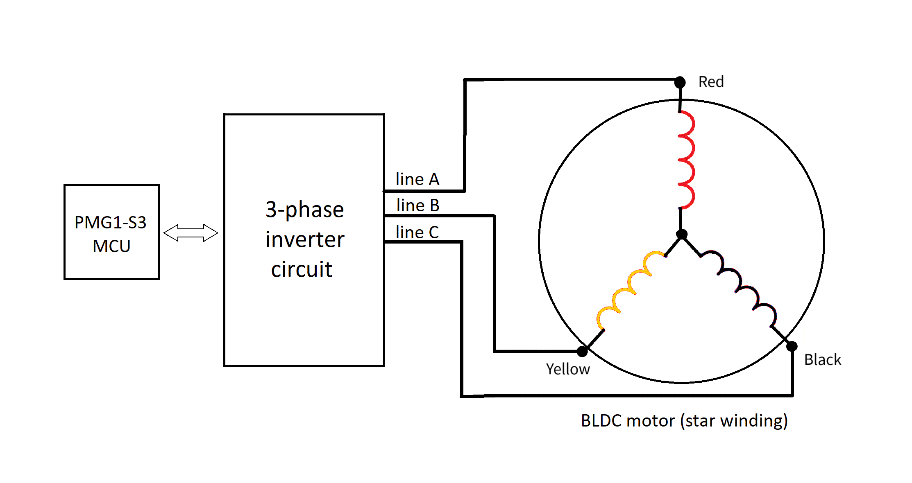

# EZ-PD&trade; PMG1 MCU: USB PD sensorless BLDC motor

This code example demonstrates an EZ-PD&trade; PMG1-S3 device-based solution for controlling sensorless three-phase BLDC motors of up to 140 watts, directly through USB PD power derived from a Type-C cable in 28 V extended power range (EPR) mode.


[View this README on GitHub.](https://github.com/Infineon/mtb-example-pmg1-usbpd-sensorless-bldc-motor)

[Provide feedback on this code example.](https://cypress.co1.qualtrics.com/jfe/form/SV_1NTns53sK2yiljn?Q_EED=eyJVbmlxdWUgRG9jIElkIjoiQ0UyMzY3MjYiLCJTcGVjIE51bWJlciI6IjAwMi0zNjcyNiIsIkRvYyBUaXRsZSI6IkVaLVBEJnRyYWRlOyBQTUcxIE1DVTogVVNCIFBEIHNlbnNvcmxlc3MgQkxEQyBtb3RvciIsInJpZCI6ImVhc292YXJnaGVzZSIsIkRvYyB2ZXJzaW9uIjoiMS4xLjAiLCJEb2MgTGFuZ3VhZ2UiOiJFbmdsaXNoIiwiRG9jIERpdmlzaW9uIjoiTUNEIiwiRG9jIEJVIjoiV0lSRUQiLCJEb2MgRmFtaWx5IjoiVFlQRS1DIn0=)


## Requirements


- [ModusToolbox&trade;](https://www.infineon.com/modustoolbox) v3.3 or later (tested with v3.3)
- Board support package (BSP) minimum required version: 3.0.0
- Programming language: C
- Associated parts: [EZ-PD&trade; PMG1-S3 MCU](https://www.infineon.com/cms/en/product/universal-serial-bus/usb-c-high-voltage-microcontrollers/ez-pd-pmg1-s3-high-voltage-mcu-with-usb-c-pd/)


## Supported toolchains (make variable 'TOOLCHAIN')

- GNU Arm&reg; Embedded Compiler v10.3.1 (`GCC_ARM`) – Default value of `TOOLCHAIN`
- Arm&reg; Compiler v6.13 (`ARM`)
- IAR C/C++ Compiler v8.42.2 (`IAR`)


## Supported kits (make variable 'TARGET')

- [EZ-PD&trade; PMG1-S3 Prototyping Kit](https://www.infineon.com/CY7113) (`PMG1-CY7113`) - Default value of `TARGET`

- EZ-PD&trade; PMG1-S3 sensorless BLDC motor control reference schematics for BLDC motor driver.

> **Note:** See the application note - [AN237305](https://www.infineon.com/an237305)

- BLY172S-24-4000 three-phase BLDC motor

## Hardware setup

1. On the CY7113 board, remove onboard resistors R17, R23, R26, R30, R45, R46, R74, R78, and R82 and mount resistors R64, R65, R67, R68, R70, and R72. This is to ensure that GPIO connections are released from CAPSENSE&trade; and connected to I/O headers.

2. See the application note [AN237305](https://www.infineon.com/an237305) to make all required connections from CY7113 (EZ-PD&trade; PMG1-S3 Prototyping Kit) to the motor driver board.
3. Verify the GPIO connections mentioned in **Table 1**.

**Table 1. GPIO connections required between PMG1-S3 device and external circuit**

 PMG1-S3 48-QFN GPIO | Motor driver  | I/O | Description 
 ----------- | ------------ |--------------| ------------
 P2.2 | BEMF-A | Input | Back EMF signal feedback from line A
 P2.3 | BEMF-B | Input | Back EMF signal feedback from line B
 P2.4 | BEMF-C | Input | Back EMF signal feedback from line C
 P2.1 | SPEED_POT | Input | Speed control potentiometer to provide analog input voltage
 P1.5 | CTRL_SW | Input | User switch for turning the motor on or off, control reset, and direction reversal
 P3.0 | CURRENT_SENSE | Input | To measure the phase current of the motor
 P3.3 | VIN_SENSE | Input | To measure the DC bus voltage supplied to the motor
 P1.3 | PWM-AH | Output | Control signal to the high-side MOSFET Q1
 P1.4 | PWM-BH | Output | Control signal to the high-side MOSFET Q3
 P6.2 | PWM-CH | Output | Control signal to the high-side MOSFET Q5
 P6.1 | PWM-AL | Output | Control signal to the low-side MOSFET Q2 
 P6.3 | PWM-BL | Output | Control signal to the low-side MOSFET Q4 
 P6.0 | PWM-CL | Output | Control signal to the low-side MOSFET Q6 

<br>

4. A 28 V USB PD adapter that supports EPR mode is recommended as the power source to connect to the PMG1-S3 kit. However, a USB PD adapter with 20 V, 5 A PDO will also support the motor operation. 

5. A standard EPR mode-supported USB Type-C cable is used to connect the Power Delivery (PD) source and sink devices.

6. Wire the three phase terminals A (red), B (yellow), and C (black) of the BLDC motor to output lines A, B, and C of the half-bridge MOSFET inverter circuit, as shown in **Figure 1**.

**Figure 1. Wiring diagram for BLDC motor**



> **Note:** The firmware requires the center terminal B (yellow) of the BLDC motor to be connected to the output line B of the inverter circuit. However, the other two terminals, A (red) and C (black) can be connected interchangeably to the outputs lines A or C of the inverter, which decides the direction of rotation of the motor.


## Software setup

See the [ModusToolbox&trade; tools package installation guide](https://www.infineon.com/ModusToolboxInstallguide) for information about installing and configuring the tools package.

[EZ-PD&trade; Protocol Analyzer Utility](https://www.infineon.com/cms/en/product/evaluation-boards/cy4500) may be used to analyze and debug the USB PD communication on the Configuration Channel (CC).

This example requires no additional software or tools.


## Using the code example


### Create the project

The ModusToolbox&trade; tools package provides the Project Creator as both a GUI tool and a command line tool.

<details><summary><b>Use Project Creator GUI</b></summary>

1. Open the Project Creator GUI tool.

   There are several ways to do this, including launching it from the dashboard or from inside the Eclipse IDE. For more details, see the [Project Creator user guide](https://www.infineon.com/ModusToolboxProjectCreator) (locally available at *{ModusToolbox&trade; install directory}/tools_{version}/project-creator/docs/project-creator.pdf*).

2. On the **Choose Board Support Package (BSP)** page, select a kit supported by this code example. See [Supported kits](#supported-kits-make-variable-target).

   > **Note:** To use this code example for a kit not listed here, you may need to update the source files. If the kit does not have the required resources, the application may not work.

3. On the **Select Application** page:

   a. Select the **Applications(s) Root Path** and the **Target IDE**.

   > **Note:** Depending on how you open the Project Creator tool, these fields may be pre-selected for you.

   b.	Select this code example from the list by enabling its check box.

   > **Note:** You can narrow the list of displayed examples by typing in the filter box.

   c. (Optional) Change the suggested **New Application Name** and **New BSP Name**.

   d. Click **Create** to complete the application creation process.

</details>

<details><summary><b>Use Project Creator CLI</b></summary>

The 'project-creator-cli' tool can be used to create applications from a CLI terminal or from within batch files or shell scripts. This tool is available in the *{ModusToolbox&trade; install directory}/tools_{version}/project-creator/* directory.

Use a CLI terminal to invoke the 'project-creator-cli' tool. On Windows, use the command-line 'modus-shell' program provided in the ModusToolbox&trade; installation instead of a standard Windows command-line application. This shell provides access to all ModusToolbox&trade; tools. You can access it by typing "modus-shell" in the search box in the Windows menu. In Linux and macOS, you can use any terminal application.

The following example clones the [USB PD sensorless BLDC motor](https://github.com/Infineon/mtb-example-pmg1-usbpd-sensorless-bldc-motor) application with the desired name "USBPDSensorlessBLDCMotor" configured for the *PMG1-CY7111* BSP into the specified working directory, *C:/mtb_projects*:

   ```
 project-creator-cli --board-id PMG1-CY7113 --app-id mtb-example-pmg1-usbpd-sensorless-bldc-motor --user-app-name USBPDSensorlessBLDCMotor --target-dir "C:/mtb_projects"
   ```

The 'project-creator-cli' tool has the following arguments:

Argument | Description | Required/optional
---------|-------------|-----------
`--board-id` | Defined in the <id> field of the [BSP](https://github.com/Infineon?q=bsp-manifest&type=&language=&sort=) manifest | Required
`--app-id`   | Defined in the <id> field of the [CE](https://github.com/Infineon?q=ce-manifest&type=&language=&sort=) manifest | Required
`--target-dir`| Specify the directory in which the application is to be created if you prefer not to use the default current working directory | Optional
`--user-app-name`| Specify the name of the application if you prefer to have a name other than the example's default name | Optional

> **Note:** The project-creator-cli tool uses the `git clone` and `make getlibs` commands to fetch the repository and import the required libraries. For details, see the "Project creator tools" section of the [ModusToolbox&trade; tools package user guide](https://www.infineon.com/ModusToolboxUserGuide) (locally available at {ModusToolbox&trade; install directory}/docs_{version}/mtb_user_guide.pdf).

</details>


### Open the project

After the project has been created, you can open it in your preferred development environment.


<details><summary><b>Eclipse IDE</b></summary>

If you opened the Project Creator tool from the included Eclipse IDE, the project will open in Eclipse automatically.

For more details, see the [Eclipse IDE for ModusToolbox&trade; user guide](https://www.infineon.com/MTBEclipseIDEUserGuide) (locally available at *{ModusToolbox&trade; install directory}/docs_{version}/mt_ide_user_guide.pdf*).

</details>


<details><summary><b>Visual Studio (VS) Code</b></summary>

Launch VS Code manually, and then open the generated *{project-name}.code-workspace* file located in the project directory.

For more details, see the [Visual Studio Code for ModusToolbox&trade; user guide](https://www.infineon.com/MTBVSCodeUserGuide) (locally available at *{ModusToolbox&trade; install directory}/docs_{version}/mt_vscode_user_guide.pdf*).

</details>


<details><summary><b>Keil µVision</b></summary>

Double-click the generated *{project-name}.cprj* file to launch the Keil µVision IDE.

For more details, see the [Keil µVision for ModusToolbox&trade; user guide](https://www.infineon.com/MTBuVisionUserGuide) (locally available at *{ModusToolbox&trade; install directory}/docs_{version}/mt_uvision_user_guide.pdf*).

</details>


<details><summary><b>IAR Embedded Workbench</b></summary>

Open IAR Embedded Workbench manually, and create a new project. Then select the generated *{project-name}.ipcf* file located in the project directory.

For more details, see the [IAR Embedded Workbench for ModusToolbox&trade; user guide](https://www.infineon.com/MTBIARUserGuide) (locally available at *{ModusToolbox&trade; install directory}/docs_{version}/mt_iar_user_guide.pdf*).

</details>


<details><summary><b>Command line</b></summary>

If you prefer to use the CLI, open the appropriate terminal, and navigate to the project directory. On Windows, use the command-line 'modus-shell' program; on Linux and macOS, you can use any terminal application. From there, you can run various `make` commands.

For more details, see the [ModusToolbox&trade; tools package user guide](https://www.infineon.com/ModusToolboxUserGuide) (locally available at *{ModusToolbox&trade; install directory}/docs_{version}/mtb_user_guide.pdf*).

</details>


## Operation

1. Complete the steps listed in the [Hardware setup](#hardware-setup) section.

2. Connect the onboard power selection jumper (J5) of the PMG1 kit at position 2-3 to power the PMG1 MCU through KitProg3 USB Type-C port (J1).

3. Connect a USB cable to the KitProg3 USB Type-C port (J1) for programming the PMG1 device.

4. Program the board using one of the following:

   <details><summary><b>Using Eclipse IDE</b></summary>

      1. Select the application project in the Project Explorer.

      2. In the **Quick Panel**, scroll down, and click **\<Application Name> Program (KitProg3_MiniProg4)**.
   </details>


   <details><summary><b>In other IDEs</b></summary>

   Follow the instructions in your preferred IDE.
   </details>


   <details><summary><b>Using CLI</b></summary>

     From the terminal, execute the `make program` command to build and program the application using the default toolchain to the default target. The default toolchain is specified in the application's Makefile but you can override this value manually:
      ```
      make program TOOLCHAIN=<toolchain>
      ```

      Example:
      ```
      make program TOOLCHAIN=GCC_ARM
      ```
   </details>

5. After programming the device, disconnect the USB cable from the J1 port and reconnect the power selection jumper (J5) at position 1-2 to configure the PMG1 kit in operational mode.

6. Connect a USB PD power adapter to the PMG1 USB PD sink port (J10) to source power to the motor. To obtain maximum performance of the motor, a 28 V EPR-supported PD adapter is recommended.

7. Confirm that the onboard user LED (LED3) of the PMG1 kit is not glowing. This indicates the absence of any error and that the motor is ready for startup.

8. Press the switch CTRL_SW once to turn on the motor. Once the motor turns on, press CTRL_SW again to turn off the motor.

9. If the user LED (LED3) blinks continuously, it means that there is an error. See **Table 5** under the [Design and implementation](#design-and-implementation) section to determine the type of error.

10. Once you have determined the error cause, fix it and press CTRL_SW twice to reset the controller.

11. After the motor is turned on, vary the speed by rotating the potentiometer SPEED_POT in either direction.

12. While the motor is in the off state, press and hold CTRL_SW until the user LED (LED3) on CY7113 kit blinks thrice to enable reverse direction for rotation. Thereafter, starting the motor normally will rotate it in the opposite direction.

13. View the runtime data of the motor on a serial UART terminal, as shown in **Figure 2** by reprogramming the MCU after enabling the `UART_PRINT_ENABLE` macro in the *main.c* file.

**Figure 2. UART serial terminal prints**


<br>


## Debugging

You can debug the example to step through the code.


<details><summary><b>In Eclipse IDE</b></summary>

Use the **\<Application Name> Debug (KitProg3_MiniProg4)** configuration in the **Quick Panel**. For details, see the "Program and debug" section in the [Eclipse IDE for ModusToolbox&trade; user guide](https://www.infineon.com/MTBEclipseIDEUserGuide).

Ensure the board is connected to the PC using a USB Type-C cable through the KitProg3 and the jumper shunt J5 is connected between 1-2. Additionally, power the kit with a USB cable through the J10 USB-C port.

</details>


<details><summary><b>In other IDEs</b></summary>

Follow the instructions in your preferred IDE.
</details>


## Design and implementation

### Sensorless BLDC motor controller

#### Three-phase BLDC motor

Three-phase BLDC motor consists of a set of stator windings powered by three phases and permanent magnetic poles arranged along the circumference of the rotor. The commutation is carried out electronically by switching the currents through two out of the three phases using a microcontroller, leaving the third phase floating. 

To determine the sequence of commutation, you need to know the current position of the rotor with respect to the stator windings. In sensorless control technique, the rotor position is determined using the back EMF (BEMF) generated when the magnet-embedded rotor rotates in-between the phase windings.

#### Trapezoidal commutation technique

The six-step trapezoidal commutation is one of the most common techniques used in sensorless BLDC motor control. The term refers to the shape of the BEMF signal generated on the phase windings during the rotation. 

To maximize the performance, the drive current should match the BEMF signal waveform. This is achieved by switching the currents through the three-phase windings dynamically in a particular sequence at a particular instant based on the relative rotor position. The set of commutation patterns for a complete rotation of the rotor can be divided into six steps, each step occurring at every 60 electrical degree rotation of the rotor, as shown in **Table 2** and **Figure 3**.

**Table 2. Commutation logic table**

 Rotor electrical angle (degree) | 0 | 60 | 120 | 180 | 240 | 300 
 ----------- | --- | --- | --- | --- | --- | --- 
  AH         |  1  |  0  |  0  |  0  |  0  |  1  
  BH         |  0  |  1  |  1  |  0  |  0  |  0  
  CH         |  0  |  0  |  0  |  1  |  1  |  0  
  AL         |  0  |  0  |  1  |  1  |  0  |  0  
  BL         |  0  |  0  |  0  |  0  |  1  |  1  
  CL         |  1  |  1  |  0  |  0  |  0  |  0  

<br>

**Figure 3. Commutation waveform**


<br>

#### Hardware design

The block diagram in **Figure 4** shows the hardware architecture and signal routing in PMG1-S3 device used for the BLDC motor control algorithm. 

**Figure 5** shows the external power circuit with six N-MOSFETs and associated gate drivers, functioning as a three-phase inverter. Various other inputs, outputs, and feedback signals are also shown in **Figure 4**.

**Figure 4. Hardware architecture for BLDC motor controller using the EZ-PD&trade; PMG1-S3 device**


<br>

**Figure 5. Power circuit for motor driving**


<br>

The functions of various peripherals used in the control firmware is given in **Table 3**.

**Table 3. PMG1-S3 peripherals used and their functions**

 PMG1-S3 peripheral | Functions 
 ------------------- | ------------------ 
 12-bit SAR ADC | To measure speed reference signal and DC bus voltage and winding current
 CTBm - OpAmp 1 | To monitor the back EMF zero-crossing event and for commutation
 TCPWM - PWM | To control the speed of the motor
 TCPWM - Counter | For motor start-up and speed measuring
 USBPD block | To sink USB PD power from a PD source to drive the motor
 SCB UART | To print the run-time parameters of the motor on a serial monitor

#### Control and commutation algorithm

The control system is divided into three stages based on the tasks done, as follows:
1. Pre-position: This is the initial phase of start-up when the rotor poles align with the stator magnetic fields. This is required to start open-loop commutation as the back EMF signal feedback is absent at low speed.

2. Free-run: During this stage, the BLDC motor is commutated blindly in open-loop as the back EMF feedback is still absent. The motor accelerates up to a threshold where the back EMF signal amplitude becomes measurable.

**Figure 6. Firmware flowchart for open-loop start-up**


<br>

3. Closed-loop control: This is the final stage of the control. Once sufficient back EMF amplitude is achieved, the control loop is closed and the motor operates in a closed loop with the feedback from the back EMF signal, as shown in **Figure 8**. The speed of the motor can be controlled throughout this stage by changing the value of the reference input signal to the ADC.

**Figure 7. Firmware flowchart for closed-loop control**


<br>

#### Firmware design and peripheral configuration

A brief information regarding the firmware design for sensorless BLDC motor control is as follows:
- A TCPWM block configured as a timer is used for the start-up timing of the motor. The start-up phase of the motor consists of the initial rotor alignment with a fixed stator winding. After the alignment, the rotor is accelerated by commutating the three phases based on the commutation logic table given in **Table 2**. The acceleration is achieved by varying the timer period in steps based on the motor's moment of inertia. During this phase, the motor operates in an open loop without any external feedback.

- Once sufficient signal amplitude is achieved for the back EMF signal in the unpowered winding phases, the firmware closes the control loop by sensing the back EMF zero-crossing events through CTBm OpAmp comparator. The analog multiplexer feeds the comparator with the back EMF signal from different phases in a cyclic manner.

- Another counter is configured to capture the time elapsed in successive back EMF zero-crossing events and is used to calculate the current motor speed. The reference speed is an analog signal applied using a potentiometer and is sensed by one of the input channels of the 12-bit SAR ADC. The error is the actual speed compared to the reference speed calculated by the firmware, which updates the necessary control effort required to nullify the error by setting the right value of PWM duty cycle and commutation delays, using a PID control algorithm.

- Two other channels of the ADC reads the sample values of input DC bus voltage and the motor winding current to implement necessary features such as undervoltage protection (UVP), overvoltage protection (OVP), and overcurrent or overload protection (OCP).

- The user inputs available for controlling the motor are the on-off control switch, the motor reset switch and the reference speed input. A user LED provides the necessary user interface to indicate various errors detected during run-time.

**Table 4** lists out the configurations of the various peripherals used in this code example.

> **Note:** The value of these parameters are dependent on the motor specifications mentioned in **Table 6** and may vary from one motor to another.

**Table 4. Peripheral configuration**

 Peripheral | Parameter | Value 
 ------------------- | ---------------------- | --------- 
 12-bit SAR ADC | Clock frequency | 1.548 MHz 
 OpAmp comparator | Interrupt | falling edge 
 PWM | frequency | 24 kHz
 Start-up timer | Period | 1 ms to 400 ms 
 Speed counter | Period | 68.265 ms 
 USB PD | PDO | (5 V,0.9 A), (20 V,3 A), (28 V,5 A) 
 SCB UART | Baud-rate | 115200 bps 

<br>

#### Closed-loop control system

During the closed-loop running stage, the BLDC motor is operated in a proportional, integral and differential (PID) control loop. The proportional control counters the deviation from the reference speed value proportionally. The integral control helps maintain speed during loading and minimizes the steady state error. The differential control helps damp the oscillations in the control and improves the dynamic response of the motor in case the reference speed varies abruptly.

**Figure 8. Block diagram of closed-loop PID control system**


<br>

#### Protection and error-detection

The firmware implements the following features for motor winding and drive circuit protection. PMG1 MCU regularly monitors the input power supply voltage, the winding current and the motor drive conditions, triggering an error case when any of the conditions cross a threshold, as mentioned in **Table 5**.

**Table 5. Error detection**

 Error condition | Threshold | Action
 ------------------- | ------------------ | ------------------
 Undervoltage | 18 V | User LED blinks in sets of two
 Overvoltage | 30 V | User LED blinks in sets of three
 Overcurrent | 3.5 A | User LED blinks in sets of four
 Lowest speed | 564 RPM | User LED blinks in sets of six
 Commutation error | - | User LED blinks continuously at 1 Hz

<br>

#### BLDC motor specification

This code example uses BLY172S-24-4000 BLDC motor. The firmware is tuned to suit the specifications of this motor mentioned in **Table 6**.

**Table 6. BLY172S-24-4000 motor specifications**

 Parameter | Rating
 ------------------------- | --------
 Number of rotor poles | 8 
 Number of stator slots| 6 
 Winding type | Star/wye
 Speed | 4000 RPM 
 Power | 53 W 
 Voltage | 24 V 
 Peak current | 3.5 A 
 Rotor type | In-runner 
 Feedback | Back EMF/Hall-sensor 
 
<br>


Other BLDC motors supported by both hardware and firmware specifications can also be used instead. However, the performance on other motors is not guaranteed.

> **Note:** See the application note [AN237305](https://www.infineon.com/an237305) for more details on firmware configuration for a motor with different specifications.

### USB Power Delivery (USB PD) sink

See [EZ-PD&trade; PMG1 MCU: USB PD sink](https://github.com/Infineon/mtb-example-pmg1-usbpd-sink) example for information related to USB PD sink design and configuration.

If the source is EPR supported, the application initiates an EPR mode entry request after an SPR contract is established. If the EPR mode entry is successful, the EPR sink maintains regular communication with the EPR source to allow EPR mode to continue.


#### Compile-time configurations

The EZ-PD&trade; PMG1 MCU USB PD sink application functionality can be customized through a set of compile-time parameters that can be turned on or off through the *config.h* header or *Makefile* file.

**Table 7. Compile-time parameters and values**

 Macro name          | Description                           | Allowed values 
 :------------------ | :------------------------------------ | :------------- 
 `CY_PD_SINK_ONLY`     | Specifies that the application supports only the USB PD sink (consumer) role | Should be set to 1u 
 `NO_OF_TYPEC_PORTS`   | Specifies the number of USB-C ports supported | Should be set to 1u 
 `CY_PD_REV3_ENABLE`   | Enable USB PD revision 3.2 support | 1u or 0u 
 `CY_PD_EPR_ENABLE`    | Enable EPR sink support | 1u or 0u 
 `PD_PDO_SEL_ALGO`     | Specifies the algorithm to use while selecting the best source capability to power the board | 0u - Pick the source PDO delivering the maximum amount of power <br>1u - Pick the fixed source PDO delivering the maximum amount of power <br>2u - Pick the fixed source PDO delivering the maximum amount of current<br>3u - Pick the fixed source PDO delivering the maximum amount of voltage 
 `BATTERY_CHARGING_ENABLE` | Enables BC 1.2 (CDP/DCP) detection when connected to a non-USB PD power source | 1u or 0u 
 `SNK_STANDBY_FET_SHUTDOWN_ENABLE` | Specifies whether the consumer power path should be disabled while PD contracts are negotiated | 1u or 0u 
 `SYS_DEEPSLEEP_ENABLE` | Enables device entry into deep sleep mode for power saving when the CPU is idle | Should be set to 0u for motor control 

<br>

#### PDStack library selection

The USB Type-C connection manager, USB PD protocol layer, and USB PD device policy engine state that machine implementations are provided in the form of pre-compiled libraries as part of the PDStack middleWare library.

Multiple variants of the PDStack library with different feature sets are provided; choose the appropriate version based on the features required for the target application.

   - PMG1_PD3_SNK_LITE: Library with support for USB Type-C sink operation and USB PD Revision 3.2 messaging.

   - PMG1_PD2_SNK_LITE: Library with support for USB Type-C sink operation and USB PD Revision 2.0 messaging. Using this library will reduce the flash (code) memory usage by the application.

   - PMG1_PD3_SNK_EPR: Library with support for USB Type-C sink EPR operation and USB PD Revision 3.2 messaging. This library is chosen by default.

Select the library of your choice by editing the **Makefile** in the application folder and changing the value of the `COMPONENTS` variable. To disable the EPR feature, set `CY_PD_EPR_ENABLE` to '0' in `DEFINES` in the **Makefile** and replace the `PMG1_PD3_SNK_EPR` reference with `PMG1_PD3_SNK_LITE`. To use the PD Revision 2.0 library, replace the reference with `PMG1_PD2_SNK_LITE`.


#### USB PD port configuration

> **Note:** See the [EZ-PD&trade; PMG1 MCU: USB PD sink](https://github.com/Infineon/mtb-example-pmg1-usbpd-sink) example for more details on basic USB PD port configuration.

**Figure 9. Enabling EPR sink support using the EZ-PD&trade; configurator**


<br>

The EPR support is enabled using the **EPR Configuration** section.

**Figure 10. EPR sink capability configuration using the EZ-PD&trade; configurator**


<br>

The extended power range capabilities supported by the application in the sink role are specified using the **EPR Sink PDO** section. A maximum of six PDOs can be added using the configurator. The maximum supported voltage and current are 28 V and 5 A, which amounts to 140 W of power sink.

Once you update the parameters as desired, save the configuration, and build the application.


### Resources and settings

**Table 8. Application resources**

 Resource  | Alias/object   | Purpose
 :-------  | :------------  | :------------------------------------ 
 USB PD | PD_PORT0 | USBPD block used for PD communication and port control
 PASS 0 12-bit SAR ADC 0 | CYBSP_ADC | To read analog input voltage for speed control and protection
 PASS 0 CTB 0 OpAmp1 | CYBSP_CTB_OA1 | Comparator to monitor the back EMF zero-crossing
 TCPWM 0 | CYBSP_PWM_CH | PWM-CH signal to MOSFET Q5 in the half-bridge inverter
 TCPWM 4 | CYBSP_PWM_AH | PWM-AH signal to MOSFET Q1 in the half-bridge inverter
 TCPWM 5 | CYBSP_PWM_BH | PWM-BH signal to MOSFET Q3 in the half-bridge inverter
 TCPWM 6 | CYBSP_CONTROL_TIMER | Multi-functional timer/counter to handle commutation, speed measurement and LED blink
 SCB 4 | CYBSP_UART | User interface to provide the control data to analyze the performance of the motor (optional)

<br>

### List of application files and their usage

 File                         | Purpose                               
 :--------------------------- | :------------------------------------ 
 *src/bldc_ctrl/bldc_controller.c & .h* | Defines function prototypes and implements functions for peripherals and motor initialization
 *src/bldc_ctrl/bemf_comp.c & .h* | Defines function prototypes and implements functions to detect back EMF signals through the analog comparator
 *src/bldc_ctrl/startup.c & .h* | Defines function prototypes and implements functions for the initial motor start-up 
 *src/bldc_ctrl/control.c & .h* | Defines function prototypes and implements functions for closed-loop control and speed measurement
 *src/bldc_ctrl/protection.c & .h* | Defines function prototypes and implements functions for various motor protections such as OVP, UVP, and OCP
 *src/bldc_ctrl/userinterface.c & .h* | Defines function prototypes and implements functions for external switch control, reference speed measurement, and error handling
 *src/bldc_ctrl/parameters.h* | Defines all required parameters related to peripheral configuration, motor specifications, and other thresholds

<br>

## Related resources

Resources  | Links
-----------|----------------------------------
Application notes |[AN232553](https://www.infineon.com/an232553) – Getting started with EZ-PD&trade; PMG1 MCU on ModusToolbox&trade; <br> [AN232565](https://www.infineon.com/an232565) – EZ-PD&trade; PMG1 MCU hardware design guidelines and checklist <br> [AN237305](https://www.infineon.com/an237305) – USB PD sensorless brushless DC (BLDC) motor controller using EZ-PD&trade; PMG1-S3 MCU <br> [AN240072](https://www.infineon.com/an240072) – Single-phase BLDC motor control using EZ-PD&trade; PMG1-S0 MCU
Code examples  | [Using ModusToolbox&trade;](https://github.com/Infineon/Code-Examples-for-ModusToolbox-Software) on GitHub
Device documentation | [PMG1 datasheets](https://www.infineon.com/PMG1DS)
Development kits | Select your kits from the [Evaluation board finder](https://www.infineon.com/cms/en/design-support/finder-selection-tools/product-finder/evaluation-board).
Libraries on GitHub | [mtb-pdl-cat2](https://github.com/Infineon/mtb-pdl-cat2) – Peripheral Driver Library (PDL) and docs
Middleware on GitHub  | [pdstack](https://github.com/Infineon/pdstack) – PDStack middleware library and docs
Tools  | [ModusToolbox&trade;](https://www.infineon.com/modustoolbox) – ModusToolbox&trade; software is a collection of easy-to-use libraries and tools enabling rapid development with Infineon MCUs for applications ranging from wireless and cloud-connected systems, edge AI/ML, embedded sense and control, to wired USB connectivity using PSoC&trade; Industrial/IoT MCUs, AIROC&trade; Wi-Fi and Bluetooth&reg; connectivity devices, XMC&trade; Industrial MCUs, and EZ-USB&trade;/EZ-PD&trade; wired connectivity controllers. ModusToolbox&trade; incorporates a comprehensive set of BSPs, HAL, libraries, configuration tools, and provides support for industry-standard IDEs to fast-track your embedded application development.

<br>


## Other resources

Infineon provides a wealth of data at [www.infineon.com](https://www.infineon.com) to help you select the right device, and quickly and effectively integrate it into your design.


## Document history

 Document title: *CE236726* – *EZ-PD&trade; PMG1 MCU: USB PD sensorless BLDC motor*

 Version | Description of change
 ------- | ---------------------
 1.0.0   | New code example
 1.1.0   | Updated code to include pmg-app-common middleware, updated the README file to mention the resistor reconfigurations required


All referenced product or service names and trademarks are the property of their respective owners.

The Bluetooth&reg; word mark and logos are registered trademarks owned by Bluetooth SIG, Inc., and any use of such marks by Infineon is under license.


---------------------------------------------------------

© Cypress Semiconductor Corporation, 2023-2025. This document is the property of Cypress Semiconductor Corporation, an Infineon Technologies company, and its affiliates ("Cypress").  This document, including any software or firmware included or referenced in this document ("Software"), is owned by Cypress under the intellectual property laws and treaties of the United States and other countries worldwide.  Cypress reserves all rights under such laws and treaties and does not, except as specifically stated in this paragraph, grant any license under its patents, copyrights, trademarks, or other intellectual property rights.  If the Software is not accompanied by a license agreement and you do not otherwise have a written agreement with Cypress governing the use of the Software, then Cypress hereby grants you a personal, non-exclusive, nontransferable license (without the right to sublicense) (1) under its copyright rights in the Software (a) for Software provided in source code form, to modify and reproduce the Software solely for use with Cypress hardware products, only internally within your organization, and (b) to distribute the Software in binary code form externally to end users (either directly or indirectly through resellers and distributors), solely for use on Cypress hardware product units, and (2) under those claims of Cypress’s patents that are infringed by the Software (as provided by Cypress, unmodified) to make, use, distribute, and import the Software solely for use with Cypress hardware products.  Any other use, reproduction, modification, translation, or compilation of the Software is prohibited.
<br>
TO THE EXTENT PERMITTED BY APPLICABLE LAW, CYPRESS MAKES NO WARRANTY OF ANY KIND, EXPRESS OR IMPLIED, WITH REGARD TO THIS DOCUMENT OR ANY SOFTWARE OR ACCOMPANYING HARDWARE, INCLUDING, BUT NOT LIMITED TO, THE IMPLIED WARRANTIES OF MERCHANTABILITY AND FITNESS FOR A PARTICULAR PURPOSE.  No computing device can be absolutely secure.  Therefore, despite security measures implemented in Cypress hardware or software products, Cypress shall have no liability arising out of any security breach, such as unauthorized access to or use of a Cypress product. CYPRESS DOES NOT REPRESENT, WARRANT, OR GUARANTEE THAT CYPRESS PRODUCTS, OR SYSTEMS CREATED USING CYPRESS PRODUCTS, WILL BE FREE FROM CORRUPTION, ATTACK, VIRUSES, INTERFERENCE, HACKING, DATA LOSS OR THEFT, OR OTHER SECURITY INTRUSION (collectively, "Security Breach").  Cypress disclaims any liability relating to any Security Breach, and you shall and hereby do release Cypress from any claim, damage, or other liability arising from any Security Breach.  In addition, the products described in these materials may contain design defects or errors known as errata which may cause the product to deviate from published specifications. To the extent permitted by applicable law, Cypress reserves the right to make changes to this document without further notice. Cypress does not assume any liability arising out of the application or use of any product or circuit described in this document. Any information provided in this document, including any sample design information or programming code, is provided only for reference purposes.  It is the responsibility of the user of this document to properly design, program, and test the functionality and safety of any application made of this information and any resulting product.  "High-Risk Device" means any device or system whose failure could cause personal injury, death, or property damage.  Examples of High-Risk Devices are weapons, nuclear installations, surgical implants, and other medical devices.  "Critical Component" means any component of a High-Risk Device whose failure to perform can be reasonably expected to cause, directly or indirectly, the failure of the High-Risk Device, or to affect its safety or effectiveness.  Cypress is not liable, in whole or in part, and you shall and hereby do release Cypress from any claim, damage, or other liability arising from any use of a Cypress product as a Critical Component in a High-Risk Device. You shall indemnify and hold Cypress, including its affiliates, and its directors, officers, employees, agents, distributors, and assigns harmless from and against all claims, costs, damages, and expenses, arising out of any claim, including claims for product liability, personal injury or death, or property damage arising from any use of a Cypress product as a Critical Component in a High-Risk Device. Cypress products are not intended or authorized for use as a Critical Component in any High-Risk Device except to the limited extent that (i) Cypress's published data sheet for the product explicitly states Cypress has qualified the product for use in a specific High-Risk Device, or (ii) Cypress has given you advance written authorization to use the product as a Critical Component in the specific High-Risk Device and you have signed a separate indemnification agreement.
<br>
Cypress, the Cypress logo, and combinations thereof, ModusToolbox, PSoC, CAPSENSE, EZ-USB, F-RAM, and TRAVEO are trademarks or registered trademarks of Cypress or a subsidiary of Cypress in the United States or in other countries. For a more complete list of Cypress trademarks, visit www.infineon.com. Other names and brands may be claimed as property of their respective owners.
